# Event Sourcing
# CQRS

::image::


---
layout: agenda
textSize: lg
items:
  - Event Sourcing
  - CQRS
---

---
layout: section
---

# Event Sourcing

---
layout: quote-image
---

::image::

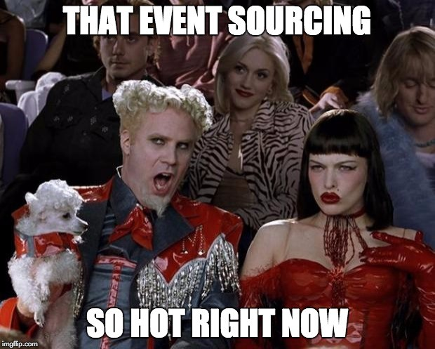

---
layout: statement
---

# Event Sourcing

An Event-driven architecture where the current application state is calculated by handling an ordered sequence of events

---
layout: default
textSize: xl
h1:
  type: brackets
  color: primary
  position: all
---

# Event Sourcing

<v-clicks depth="2">

- An Event-driven architecture
- Storing Events vs Application State
- The Event Store: a very complete Audit Log
- Events should be Domain Events
- Events should be reversible
- You'll have to teach each dev the "right way"

</v-clicks>

<!--
Save Events as JSON, XML or whatever.
In whatever you want: FileSystem, Database, ...

Typically: EventName (className), Version, TimeStamp, Sequence & Data

Event Store:
https://github.com/EventStore/EventStore

Domain Events:
- Insert, Update, Edit, Delete xxx Events are not Domain Events

Reversible Events:
- Contain the diff instead of the new value
- Or also contain a copy of the previous state
-->

---
layout: quote-image
---

# Event Sourcing

::image::

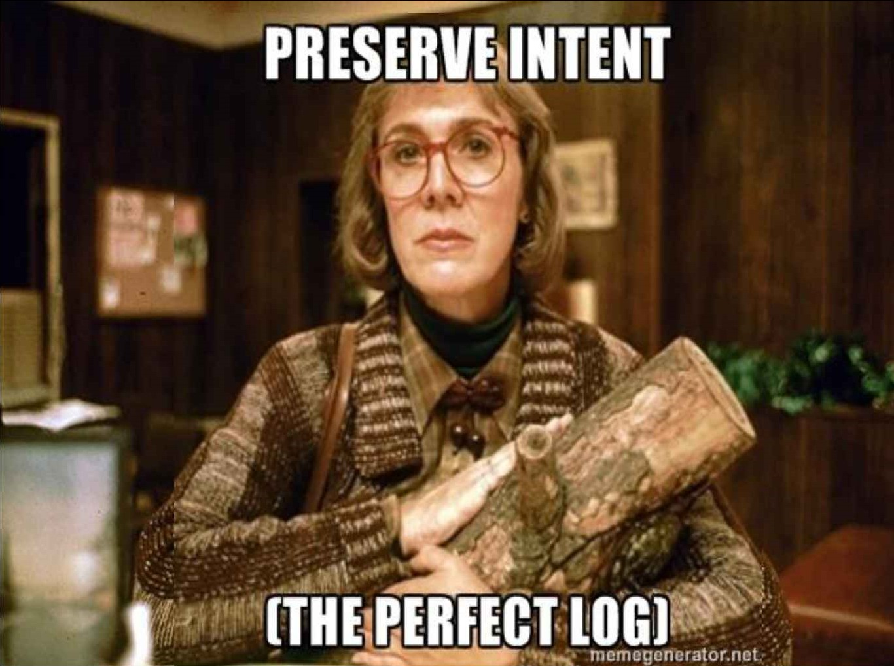

---
layout: default-aside
textSize: xl
h1:
  type: hash
  color: muted
  position: start
---

# Features

<v-clicks depth="2">

- Complete Rebuild
- Temporal Queries
- Event Replay
  - Projections
  - Rewriting History
  - Debugging

</v-clicks>

::image::


---
layout: default-aside
textSize: xl
---

# Feature: Complete Rebuild

## Replaying a lot of events -- that's gonna take time!

<v-clicks depth="2">

- Rehydration
- Do Store the Application State
  - In memory
  - In a database
- Create snapshots

</v-clicks>

::image::


<!--
Is this a feature? Or a liability?
-->

---
layout: default-aside
---

# Feature: Temporal Queries

## With a database: You can only get the current state

<v-clicks depth="2">

- With event-sourcing
  - What was the state at any time
  - How did we get to our current state

</v-clicks>

<div v-click class="mt-20 mr-80">

```ts
function getAddress(at: Date)
```

</div>

::image::

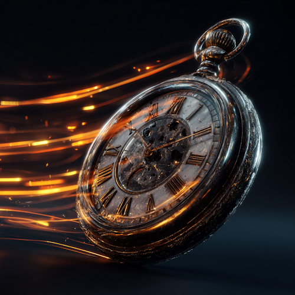

---
layout: default-aside
h1:
  type: dot
  color: muted
  position: end
---

# Feature: Projections

<v-clicks>

- Application State
- Human Readable Audit Log
- BI & Reporting
- ElasticSearch

</v-clicks>

::image::


<!--
When projection logic changes, you can rebuild by replaying all events — one of ES's killer features.

Strategies: replay from position 0 (drop & rebuild), catch-up subscriptions (track a checkpoint, read forward), or blue/green projections (build new alongside old, swap when caught up).
-->

---
layout: default-aside
---

# Feature: Rewriting History

<v-clicks>

- Correct Errors
- Domain Rule Changes
- Merge Events
- Multiple Timelines

</v-clicks>

::image::


<!--
**Events should be immutable**

Git: like you have both revert vs reset/amend in git, you also have both options available to you

**Be Pragmatic:** if changing events is easier to accomplish, or even required in the domain, why not?
-->

---
layout: default-aside
h1:
  type: slashes
  color: primary
  position: end
---

# When to EventSource

## When your domain requires one or more of those features!

<v-clicks depth="2">

- NOT Your Typical CRUD Enterprise Application
- Complex Domain & Many Business Rules
  - Rules that change over time
- Task Based UI

</v-clicks>

::image::


<!--
When: You need to answer Temporal Queries. Or you need to rewrite history.
-->

---
layout: default-aside
textSize: xl
---

# When: Linearization

## You **want** a global ordering of events

<v-clicks>

- For the 10% of apps where this is not the case, there is extra complexity
  - Causal Consistency
  - Conflict Detection

</v-clicks>

::image::


<!--
You want global ordering: because it makes things much easier.

Causally related events are executed in a "happens-before relationship".

MongoDB has this.
-->

---
layout: default-aside
textSize: xl
---

# When No Linearization

<v-clicks>

- Very (very) high throughput
- Favor availability over consistency
- Occasionally connected servers
- Clients with bad wifi, tunnels, ...

</v-clicks>

::image::


---
layout: default-aside
fontSize: xl
---

# Examples

<v-clicks>

- Version Control System
- Finance & Accounting
- Gambling & Lotteries
- Redux
- Barema Wage Calculation

</v-clicks>

::image::

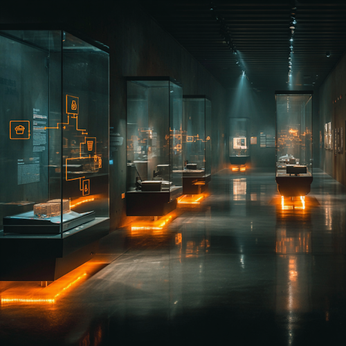

---
layout: default-aside
textSize: sm
---

# Implementation
## Event Store Technologies

<v-clicks depth="2">

- EventStoreDB
  - Purpose-built, Greg Young's project
  - Projections, subscriptions, built-in stream model
- Kafka
  - Distributed log, not an event store
  - No stream-per-aggregate, no optimistic concurrency
- Marten (.NET)
  - PostgreSQL as event store + document DB
- Axon (Java/Kotlin)
  - Full framework: ES + CQRS + Sagas
- DIY: any append-only table works

</v-clicks>

::image::


<!--
EventStoreDB is the canonical choice for a dedicated event store.

Kafka is often confused with an event store — it's a distributed commit log. Missing key ES features: no optimistic concurrency per stream, no built-in snapshots, retention policies can delete events.

Marten is great for .NET shops that don't want to run a separate database.

DIY: a simple `Events` table with `StreamId`, `Version`, `EventType`, `Data`, `Timestamp` gets you surprisingly far.
-->

---
layout: default-aside
h1:
  type: braces
  color: muted
  position: all
---

# Implementation
## Transaction Script

```csharp
class PublishEvent {
  String JointCommittee;
  Date PublishDate;
}

class PublishHandler : Handler<PublishEvent> {
  void Handle(PublishEvent e) {
    var stream = store.Load(e.JointCommittee);
    stream.Apply(new Published(e.JointCommittee, e.PublishDate));
    store.Save(stream);
  }
}
```

::image::

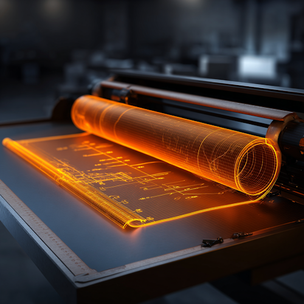

<!--
The alternative is to work with a Domain Model.
-->

---
layout: default-aside
textSize: xl
---

# Implementation
## Event Handler Selection

<v-clicks depth="2">

- Inside the event itself
- Reflection
  - Configuration Files
  - Naming Convention
  - ~~A Library~~
- Process Manager

</v-clicks>

::image::

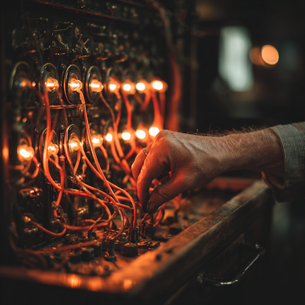

---
layout: default-aside
h1:
  type: semicolon
  color: muted
  position: end
---

# Implementation
## Process Manager

<v-clicks>

- The flow as a first class citizen
- Manage process state
- Routing slip
- A State Machine

</v-clicks>

::image::


<!--
**Process Manager:**

Once several subsystems start handling events, the system becomes hard to visualize / conceptualize.

The source code no longer tells you how the application reacts to user actions.

Instead you can use a Process Manager to delegate (Event -> Command(s))
-->

---
layout: default-aside
---

# Challenges
## Event Versioning

<v-clicks depth="2">

- Backwards Compatible Please
- Rewrite History vs Upcaster
- EventV2
- GDPR: Encryption & Pseudonymization
  - Events are immutable, but users want to be forgotten

</v-clicks>

::image::

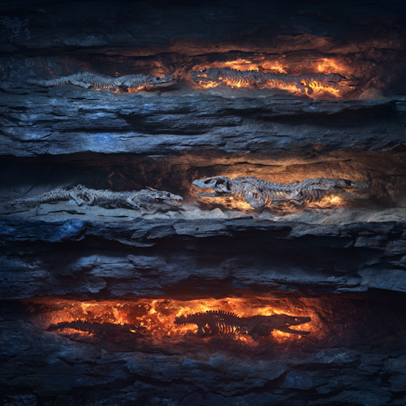

<!--
Protobuf: Built with this in mind

GDPR: If events are immutable, how do you delete user data? Options: encrypt event payloads per-user and destroy the key on deletion (crypto-shredding), or pseudonymize PII fields so events remain valid but untraceable.

Upcaster: transforms old event versions to the current schema on-the-fly when reading from the store — no migration needed. Rewrite History actually changes stored events; Upcaster leaves them untouched and converts in memory. Axon and Marten have built-in support.
-->

---
layout: default-aside
textSize: xl
---

# Challenges
## External Systems

<v-clicks depth="2">

- A Gateway
  - Mock during Replay
  - Store original reply

</v-clicks>

::image::


---
layout: default-aside
---

# Challenges
## Idempotency

<v-clicks depth="2">

- Events may be delivered more than once
  - At-least-once delivery
  - Retries after failures
- Event handlers must produce the same result when replayed
- Strategies
  - Idempotency keys / deduplication
  - Conditional writes (check current state before applying)
  - Natural idempotency (set value vs increment)

</v-clicks>

::image::

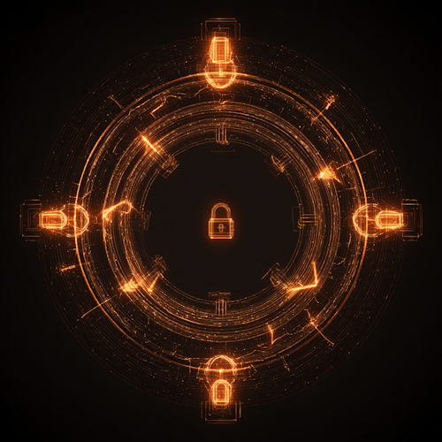

<!--
More in the Microservices session!

This is critical for Event Replay and Projections to work correctly.

If your handler does `balance += amount` instead of `balance = newBalance`, replaying the event doubles the effect.

At-least-once is the norm in distributed systems. Exactly-once is essentially at-least-once + idempotent handlers.
-->

---
layout: break
---

# ☕ Break

::timer::

<Timer minutes="10" />

::image::


---
layout: section
---

# CQRS

::subtitle::

Command Query Responsibility Segregation

---
layout: default-aside
textSize: xl
h1:
  type: brackets
  color: primary
  position: 1
---

# CQS

## Command-Query Separation

<v-clicks depth="2">

- Each method is either a
  - Command: perform an action
  - Query: return data to the user

</v-clicks>

<div v-click class="text-center text-primary mt-20">

CQRS scales CQS to the architectural level

</div>


::image::


<!--
1988, Bertrand Meyer, Object Oriented Software Construction.
-->

---
layout: quote-image
---

# CQRS

::image::

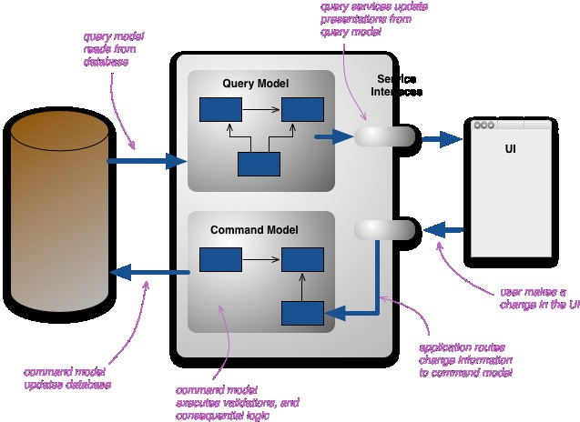

<!--
https://martinfowler.com/bliki/CQRS.html
-->

---
layout: default-aside
h1:
  type: hash
  color: muted
  position: start
---

# CQRS - What

<v-clicks>

- Read & Write Models
- Read & Write Databases
- Complexity Booster
- Eventual Consistency

</v-clicks>

::image::

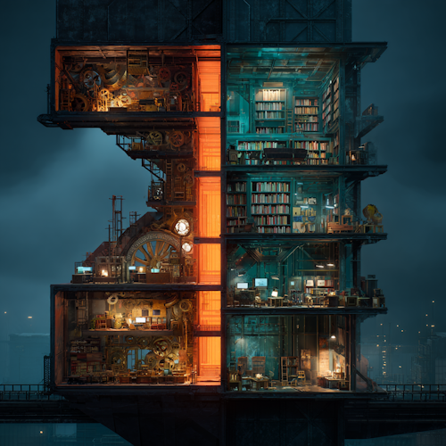

---
layout: default-aside
---

# CQRS - When

<v-clicks>

- Complex BL & DDD
- Non CRUD
- Specific Portions of the app (BoundedContext)

</v-clicks>

::image::


---
layout: statement
---

# CQRS - Danger

Despite these benefits, you should be **very cautious about using CQRS**...

... while CQRS is a pattern that's good to have in the toolbox, beware that it is difficult to use well.

-- Martin Fowler

::image::


<!--
The part in bold is the ONLY part in Fowler's article that is in bold.
-->

---
layout: two-col-image-text
h1:
  type: braces
  color: primary
  position: all
image: ./images/meme-hard-to-swallow-pills.jpg
---

# Common Anti-Patterns

## (from Greg Young)

::content::

<v-clicks>

- Not top-level architectures
- **Not** top-level architectures
- Pick & Choose those parts that will benefit from it

</v-clicks>

<!--
Not top-level architectures:
https://itenium.be/blog/design/CQRS-Ramble/
-->

---
layout: default-aside
textSize: xl
h1:
  type: slashes
  color: muted
  position: end
---

# Common Anti-Patterns

## (from Greg Young)

<v-clicks depth="2">

- The Write Side Queries The Read Side
  - Be Pragmatic!
- Don't use Frameworks
  - Functions
  - Pattern Matching
  - Fold

</v-clicks>

::image::

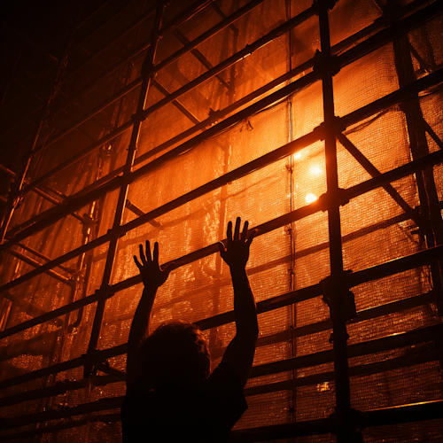

---
layout: statement
---

# Use Case

Herberekening uitbetaalde pensioenen parlementsleden?

Piece of cake with Event-Sourcing! 😃

::image::

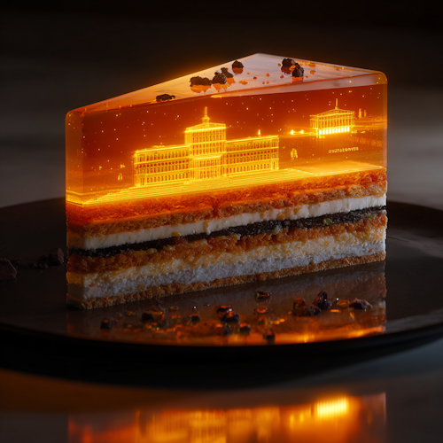

---
layout: default-aside
h1:
  type: dot
  color: muted
  position: end
---

# Barema's

<v-clicks depth="2">

- A certain set of rules apply per CAO publish
- Publishes are Snapshots
- Events are divided per JointCommittee
- Mistakes will occur
  - We need to go back in time,
  - Adjust, insert or delete events
  - History will be rewritten

</v-clicks>

::image::


<!--
JointCommittee==Paritair Comite. 200 for us.
-->

---
layout: two-col-image-text
image: ./images/event-storming-whiteboard.jpg
disabled: true
---

# Event Storming

::content::

<v-clicks>

- Business Process Modeling
- Requirements engineering
- Maybe a future soft-skill workshop session?

</v-clicks>

<!--
Alberto Brandolini in the context of domain-driven design (DDD)
-->

---
layout: quote-image
---

# Quiz

::image::

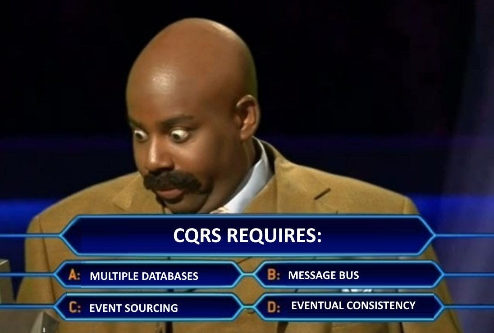

---
layout: socials
---

---
layout: source
source: itenium-be/EventSourcing-CQRS
---

---
layout: end
---
