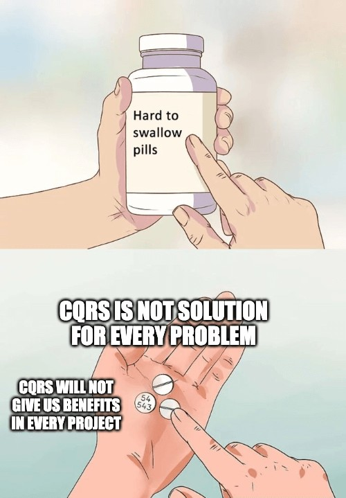
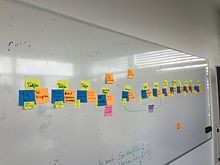

# Event Sourcing
# CQRS

::image::


---
layout: agenda
textSize: lg
items:
  - Event Sourcing
  - CQRS
---

---
layout: section
---

# Event Sourcing

---
layout: quote-image
---

::image::


---
layout: statement
---

# Event Sourcing

An Event-driven architecture where the current application state is calculated by handling an ordered sequence of events

---
layout: default
textSize: xl
h1:
  type: brackets
  color: primary
  position: all
---

# Event Sourcing

<v-clicks depth="2">

- An Event-driven architecture
- Storing Events vs Application State
- The Event Store: a very complete Audit Log
- Events should be Domain Events
- Events should be reversible
- You'll have to teach each dev the "right way"

</v-clicks>

<!--
Save Events as JSON, XML or whatever.
In whatever you want: FileSystem, Database, ...

Typically: EventName (className), Version, TimeStamp, Sequence & Data

Event Store:
https://github.com/EventStore/EventStore

Domain Events:
- Insert, Update, Edit, Delete xxx Events are not Domain Events

Reversible Events:
- Contain the diff instead of the new value
- Or also contain a copy of the previous state
-->

---
layout: quote-image
---

# Event Sourcing

::image::


---
layout: default
textSize: xl
h1:
  type: hash
  color: muted
  position: start
---

# Features

<v-clicks depth="2">

- Complete Rebuild
- Temporal Queries
- Event Replay
  - Projections
  - Rewriting History
  - Debugging

</v-clicks>

---
layout: default
textSize: sm
---

# Feature: Complete Rebuild

<v-clicks depth="2">

- Replaying a lot of events -- that's gonna take time!
- Rehydration
- Do Store the Application State
  - In memory
  - In a database
- Create snapshots

</v-clicks>

<!--
Is this a feature? Or a liability?
-->

---
layout: default
---

# Feature: Temporal Queries

```ts
function getAddress(at: Date)
```

<!--
With a database: You can only get the current state

With event-sourcing:
What was the state at any time
How did we get to our current state
-->

---
layout: default
h1:
  type: dot
  color: muted
  position: end
---

# Feature: Projections

<v-clicks>

- Application State
- Human Readable Audit Log
- BI & Reporting
- ElasticSearch

</v-clicks>

---
layout: default
---

# Feature: Rewriting History

<v-clicks>

- Correct Errors
- Domain Rule Changes
- Merge Events
- Multiple Timelines

</v-clicks>

<!--
**Events should be immutable**

Git: like you have both revert vs reset/amend in git, you also have both options available to you

**Be Pragmatic:** if changing events is easier to accomplish, or even required in the domain, why not?
-->

---
layout: default
h1:
  type: slashes
  color: primary
  position: end
---

# When to EventSource

<v-clicks>

- When your domain requires one or more of those features!
- NOT Your Typical CRUD Enterprise Application
- Complex Domain & Many Business Rules
- Rules that change over time
- Task Based UI

</v-clicks>

<!--
When: You need to answer Temporal Queries. Or you need to rewrite history.
-->

---
layout: default
---

# When: Linearization

<v-clicks>

- You want a global ordering of events
- For the 10% of apps where this is not the case, there is extra complexity
  - Causal Consistency
  - Conflict Detection

</v-clicks>

<!--
You want global ordering: because it makes things much easier.

Causally related events are executed in a "happens-before relationship".

MongoDB has this.
-->

---
layout: default
textSize: sm
---

# When No Linearization

<v-clicks>

- Very (very) high throughput
- Favor availability over consistency
- Occasionally connected servers
- Clients with bad wifi, tunnels, ...

</v-clicks>

---
layout: default
---

# Examples

<v-clicks>

- Version Control System
- Finance & Accounting
- Gambling & Lotteries
- Redux
- Barema Wage Calculation

</v-clicks>

---
layout: default
h1:
  type: braces
  color: muted
  position: 2
---

# Implementation
## Transaction Script

```csharp
class PublishEvent {
    String JointCommittee;
    Date PublishDate;
}

class PublishHandler : Handler<PublishEvent>
```

<!--
The alternative is to work with a Domain Model.
-->

---
layout: default
textSize: sm
---

# Implementation
## Event Handler Selection

<v-clicks>

- Inside the event itself
- Reflection
- Configuration Files
- Naming Convention
- A Library
- Process Manager

</v-clicks>

---
layout: default
h1:
  type: semicolon
  color: muted
  position: end
---

# Implementation
## Process Manager

<v-clicks>

- The flow as a first class citizen
- Manage process state
- Routing slip
- A State Machine

</v-clicks>

<!--
**Process Manager:**

Once several subsystems start handling events, the system becomes hard to visualize / conceptualize.

The source code no longer tells you how the application reacts to user actions.

Instead you can use a Process Manager to delegate (Event -> Command(s))
-->

---
layout: default
---

# Challenges
## Event Versioning

<v-clicks>

- Backwards Compatible Please
- Rewrite History
- EventV2

</v-clicks>

<!--
Protobuf: Built with this in mind
-->

---
layout: default
---

# Challenges
## External Systems

<v-clicks>

- A Gateway
- Mock during Replay
- Store original reply

</v-clicks>

---
layout: break
---

# ☕ Break

::timer::

<Timer minutes="10" />

::image::


---
layout: section
---

# CQRS

::subtitle::

Command Query Responsibility Segregation

---
layout: default
h1:
  type: brackets
  color: primary
  position: 1
---

# CQS

## Command-Query Separation

<v-clicks>

- Each method is either a
  - Command: perform an action
  - Query: return data to the user

</v-clicks>

<!--
1988, Betrand Meyer, Object Oriented Software Construction.
-->

---
layout: quote-image
---

# CQRS

::image::


<!--
https://martinfowler.com/bliki/CQRS.html
-->

---
layout: default
h1:
  type: hash
  color: muted
  position: start
---

# CQRS - What

<v-clicks>

- Read & Write Models
- Read & Write Databases
- Complexity Booster
- Eventual Consistency

</v-clicks>

---
layout: default
---

# CQRS - When

<v-clicks>

- Complex BL & DDD
- Non CRUD
- Specific Portions of the app (BoundedContext)

</v-clicks>

---
layout: quote
---

# CQRS - Danger

Despite these benefits, you should be **very cautious about using CQRS**...

... while CQRS is a pattern that's good to have in the toolbox, beware that it is difficult to use well.

-- Martin Fowler

<!--
The part in bold is the ONLY part in Fowler's article that is in bold.
-->

---
layout: default-aside
h1:
  type: braces
  color: primary
  position: all
---

# Common Anti-Patterns

## (from Greg Young)

<v-clicks>

- Not top-level architectures
- Not top-level architectures
- Pick & Choose those parts that will benefit from it

</v-clicks>

::image::



<!--
Not top-level architectures:
https://itenium.be/blog/design/CQRS-Ramble/
-->

---
layout: default
textSize: sm
h1:
  type: slashes
  color: muted
  position: end
---

# Common Anti-Patterns

## (from Greg Young)

<v-clicks>

- The Write Side Queries The Read Side
- Be Pragmatic!
- Don't use Frameworks
  - Functions
  - Pattern Matching
  - Fold

</v-clicks>

---
layout: statement
---

# Use Case

Herberekening uitbetaalde pensioenen parlementsleden?

Piece of cake with Event-Sourcing! 😃

---
layout: default
h1:
  type: dot
  color: muted
  position: end
---

# Barema's

<v-clicks>

- A certain set of rules apply per CAO publish
- Publishes are Snapshots
- Events are divided per JointCommittee
- Mistakes will occur
- We need to go back in time,
- Adjust, insert or delete events
- History will be rewritten

</v-clicks>

<!--
JointCommittee==Paritair Comite. 200 for us.
-->

---
layout: default-aside
---

# Event Storming

<v-clicks>

- Business Process Modeling
- Requirements engineering
- Maybe a future soft-skill workshop session?

</v-clicks>

::image::



<!--
Alberto Brandolini in the context of domain-driven design (DDD)
-->

---
layout: quote-image
---

# Quiz

::image::


---
layout: socials
---

---
layout: source
source: itenium-be/EventSourcing-CQRS
---

---
layout: end
---
